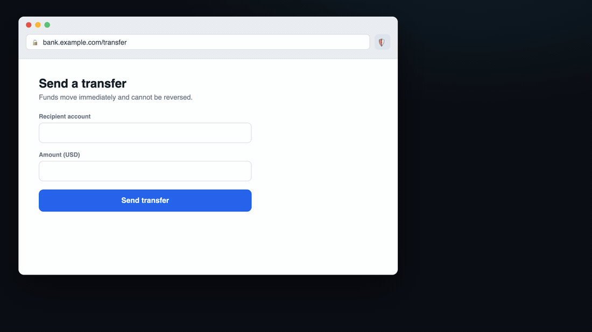

> **[OpenA2A](https://github.com/opena2a-org/opena2a)**: [CLI](https://github.com/opena2a-org/opena2a) · [HackMyAgent](https://github.com/opena2a-org/hackmyagent) · [Secretless](https://github.com/opena2a-org/secretless-ai) · [AIM](https://github.com/opena2a-org/agent-identity-management) · [Browser Guard](https://github.com/opena2a-org/AI-BrowserGuard) · [DVAA](https://github.com/opena2a-org/damn-vulnerable-ai-agent)

[](./STATUS.md)
[](https://github.com/opena2a-org/AI-BrowserGuard/actions/workflows/ci.yml)
[](https://github.com/opena2a-org/AI-BrowserGuard)
[](LICENSE)
[](https://developer.chrome.com/docs/extensions/mv3/)

Chrome extension that detects and monitors AI agents operating in your browser -- Playwright, Puppeteer, Selenium, Anthropic Computer Use, and OpenAI Operator -- without requiring the agent to identify itself. For in-page and injected automation it can also block scripted navigations, form submissions, new-tab opens, and downloads (best-effort, in the page realm). It **cannot** block external automation frameworks that drive the browser over CDP; against those, AI Browser Guard provides detection, alerting, and a kill switch that closes the tab -- not per-action enforcement. See [Scope of enforcement](#what-it-does).

[](https://chromewebstore.google.com/detail/ojphpdmabflmcjhglfogmkdgchkncikf)

[Install from Chrome Web Store](https://chromewebstore.google.com/detail/ojphpdmabflmcjhglfogmkdgchkncikf) | [Website](https://opena2a.org/aibrowserguard) | [Privacy Policy](https://opena2a.org/aibrowserguard/privacy)



An AI agent takes over a tab. AI Browser Guard detects it without the agent identifying itself, flags the transfer it tries to submit, and the kill switch (Ctrl+Shift+K) closes the tab the agent controls.

---

## What It Does

- **Detects agent takeover without notice** -- Browser-based AI agents can control your session via CDP, WebDriver, or behavioral automation. AI Browser Guard detects their presence using three independent detection layers: CDP debugger monitoring, V8 stack trace analysis, and environment fingerprinting. Detection works against external frameworks; enforcement does not (see Scope of enforcement).
- **Constrains in-page automation** -- Delegation rules define what an in-page/injected agent can do. Scripted navigations, form submissions, synthetic clicks and typing, new-tab opens, and (under an active delegation) downloads are blocked best-effort in the page realm, with a notification for each block. **This does not apply to external CDP frameworks**, which act via native input the page realm cannot intercept.
- **Logs what it can see** -- Page-realm agent actions are logged to a session timeline with timestamps, target URLs, elements, and outcomes (allowed/blocked). The last 5 sessions are retained. A session driven by an external CDP framework will show few or no actions **because its native input is not observable, not because nothing happened** -- reports state this scope explicitly.
- **Kill switch** -- One-click stop. Revokes delegations, dispatches a page-realm stop to in-page automation, and **closes the tabs an agent controls** (the real interruption of an in-progress action). It does **not** terminate an external CDP session -- an extension cannot -- and a persistent external driver can reopen a tab. Keyboard shortcut: Ctrl+Shift+K / Cmd+Shift+K.

> **Scope of enforcement.** Detection and monitoring work against every framework above; per-action blocking does not. External frameworks drive the browser over CDP with native input the page realm cannot intercept, so against them AI Browser Guard detects, alerts, and closes the tab, but cannot enforce per-action policy. The only categorical prevention is a managed-Chrome policy, `RemoteDebuggingAllowed=false`; Chrome 136+ already blocks remote debugging of your default profile by default. The per-action blocking below applies only to in-page / injected automation, is best-effort (a hostile page can re-patch the wrapped globals), and does not yet cover every in-page sink. See [ADR-008](docs/adr/008-enforcement-scope.md) for the rationale and boundary.

## Detected Frameworks

Every method below has been verified against the real framework.

| Framework | Detection Method |
|-----------|-----------------|
| Playwright | CDP debugger attachment, `UtilityScript.evaluate` in V8 stack traces |
| Puppeteer | CDP debugger, `pptr:evaluate` stack traces, `navigator.webdriver`, dimension inversion |
| Selenium | CDP debugger, `callFunction`/`executeScript` stack traces, dimension equality |
| Anthropic Computer Use | Software WebGL renderer (llvmpipe/Mesa), Xvfb screen resolution, Linux fingerprint |
| OpenAI Operator | Same as Playwright (Operator uses Playwright internally) + cloud environment signals |
| Generic CDP/WebDriver | `chrome.debugger.getTargets()`, `navigator.webdriver` flag |

## Install

**Chrome Web Store (recommended):**

[Install AI Browser Guard](https://chromewebstore.google.com/detail/ojphpdmabflmcjhglfogmkdgchkncikf) -- one click, automatic updates.

**From source:**

```bash
git clone https://github.com/opena2a-org/AI-BrowserGuard.git
cd AI-BrowserGuard
npm install && npm run build
```

Then open `chrome://extensions`, enable Developer mode, click Load unpacked, and select `dist/`.

## Delegation Presets

| Preset | What the Agent Can Do |
|--------|----------------------|
| Read-Only | Navigate and read pages. No clicking, typing, or form submission. |
| Limited | Interact with specific sites (user-defined allowlist), time-bounded (15min/1hr/4hr). |
| Full Access | Unrestricted, but all actions are logged and boundary alerts remain active. |

> **These presets are enforced best-effort against in-page / injected automation only.** External CDP frameworks bypass them entirely; for those agents a preset is a recorded intent, not an enforced boundary, and the kill switch (close tab) is the hard stop. See [Scope of enforcement](#what-it-does).

Site allowlists and blocklists support glob patterns (e.g., `*.bank.com`).

## Privacy

By default the extension makes zero network requests. All detection, delegation, and session tracking runs locally in the browser, and there is no analytics or telemetry.

Four optional network features are **off by default** and only act after you explicitly enable them:

- **AIM identity lookup** (`aim.opena2a.org`) and **registry trust lookup** (`api.oa2a.org`): when an agent is detected, look up a trust score for that agent type. Only the detected agent type (for example `playwright`) is sent; never your URLs or page content.
- **Anonymized contribution** (`api.oa2a.org`): share anonymized detection and behavior summaries to improve community threat intelligence. Prompted once after 5 detections; dismissible. Sends an anonymous token plus framework name and summary counts -- never URLs, page content, keystrokes, or identity.
- **Site safety declarations** (the site the agent is on): when an agent is detected on a page, read that site's [`/.well-known/ai-safety.txt`](https://datatracker.ietf.org/doc/draft-fane-ai-safety-txt/) and show what the site claims about its own content. This is the only feature that contacts a server we do not operate. It sends no cookies, no page address, and nothing about you; it follows no redirects; it reads declarations only over HTTPS; and it runs only while an agent is detected, never on pages you browse yourself. A declaration is self-asserted, so it is shown for information and never changes what the extension detects or blocks.

One-click opt out for each. See [ADR-006](docs/adr/006-opt-in-network-features.md), [ADR-009](docs/adr/009-ai-safety-txt-consumer.md), and the full policy: [opena2a.org/aibrowserguard/privacy](https://opena2a.org/aibrowserguard/privacy).

## Development

```bash
npm install          # Install dependencies
npm run build        # Build to dist/
npm run dev          # Watch mode
npm run test         # 520 tests
npm run lint         # TypeScript strict checking
```

## Contributing

Contributions are welcome. Open an issue to discuss proposed changes before submitting a pull request. All PRs require passing CI and code review.

## License

[Apache-2.0](LICENSE)

---

Part of the [OpenA2A](https://opena2a.org) ecosystem. See also: [HackMyAgent](https://github.com/opena2a-org/hackmyagent), [Secretless AI](https://github.com/opena2a-org/secretless-ai), [DVAA](https://github.com/opena2a-org/damn-vulnerable-ai-agent), [AIM](https://github.com/opena2a-org/agent-identity-management).
